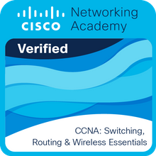
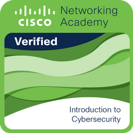
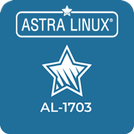

## About me

Hi, I'm Semyon 👋

I am interested in system administration and am currently studying to become a programmer in order to subsequently achieve success in the direction of DevOps. I find a lot of interesting things in this direction and strive to develop my skills.

---
### Skills 
- Linux/Unix
- Сisco IOS
- CCNA Networking Skills
- Python
- C / C++ / C#
- Git
- DevOps:
  * Docker / Kubernetes
  * Ansible
  * Terraform
  * Jenkins
  * Grafana
### Learning now
- Rust
- Powershell
  
---
### Badges

 

---
### Stats

