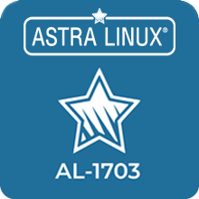

## About me

Hey there!👋 I'm Semyon

I'm all about system admin stuff. Right now, I'm studying to be a programmer and eventually become a DevOps pro. It's a really interesting field and I'm working hard to improve my skills.

---
### Skills 
- Linux/Unix
- Сisco IOS
- CCNA Networking Skills
- Python
- C / C++ / C#
- Git
- DevOps:
  * Docker / Kubernetes
  * Ansible
  * Terraform
  * Jenkins
  * Grafana
### Learning now
- Rust
- Powershell
  
---
### Badges

 

